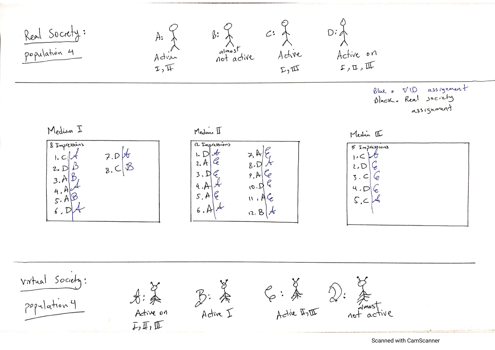

# OpenMeasurement initiative

Advertisers need to measure the performance of their ad campaigns in order to understand their efficiency and optimize future buys.  However, as the advertising landscape has fragmented across multiple platforms and devices, the ability to measure true “deduplicated” cross-media reach and frequency has become more difficult.  At the same time, living in the information age almost all viewership activities can be logged.  It is therefore reasonable to begin to imagine the possibility of a universal, all-inclusive, reach and frequency deduplication report across all media.  The major obstacle to achieving this goal is issues with sharing viewership data.

Currently the ad viewership data is owned by the publishers. This means that the necessary first step to achieve true cross-media measurement is the ability to aggregate ad viewership data across multiple publishers. However, there are many technical, legal and other obstacles to achieve this. First, important and potentially sensitive information about individual users can be revealed in the joined data. In addition, publishers usually do not trust sharing their valuable viewership data with their competitors. The situation is even more complicated for larger companies, where the legalities concerning the user privacy makes the process of sharing ad viewership logs much more involved. As a result, we need a privacy-preserving framework for ad data collection across multiple parties.

We aspire to provide the following
 * A completely open framework, to test, verify, and utilize by all the parties.
 * A flexible methodology, to take into account the desired measurement quantities, advertising patterns, targetted audience, as well as the fundamental difference between different type of impressions.

# The virtual society framework for cross-screen measurement

Virtual people are fictitious IDs (numbers) that are possibly equipped with demographics and interests as well as the probability of exposure (activity) in each media. They match the total number as well as the statistical charactristics of the census, and their activities mimics the reach and frequency of the real advertising campaigns. It should not come as a surprise that a model of virtual people should either be almost exactly the actual people (leading exactly correct deduplicated reach and frequency if all people are observed) or is so generic that leads to large errors in measurement, therefor rendering it almost useless.

## The importance of privacy and history references to what is already achieve
There are multiple methods to approach privacy-preserving advertisement and measurement. A well explored option is to simply add an appropriate amount of noise to the data aggregation. This noise “smears” the outcome of the report  and thus prevents the revealing of any traceable sensitive private information about an individual viewer. It is possible to formulate the exact amount of noise required by means of rigorous mathematical definition -- a key theme in the rising new field of *differential privacy*. However, this addition of noise alway comes with the price of losing accuracy. For example early experiments have shown that if publishers add noise separately to their local data and then aggregate, the final outcome may not possess the required level of accuracy for the frequency estimation.

However, even before the application of differentially private estimator, there is a need for standardization across different sources of data as well as providing the imputations and possible corrections required for the aggregation stage to flow correctly. This process can be merged with a probabilistic modeling method for the reach and frequency, referred to as the virtual people identifier (VID) assignment. The virtual people are representatives of the ad viewing society. In the assignment process the ad viewing logs are converted to viewing logs or impressions that are assigned to VIDs instead of real users. The VID impressions is designed (and can be made) to be actionable in a sense that advertisers should be allowed to slice tables across demographics, media, and possible time periods and receive a consistent result approximately similar to the true report, that is if the full and appropriately deduplicated viewership data across all media/publishers were known.

It is important to note that, despite the probabilistic nature of VID assignment for ad viewership, this process by itself does not protect individual users privacy and VID impressions logs should not be distributed across publishers without further processing. It has been shown that if only the total deduplicated reach is desired, the VID ad logs may be sent through a set of noisy cardinality estimators, where the individual viewership pattern is protected by adding noise to the aggregated estimators, i.e. differential privacy. The outcome of the noisy estimator can then be unionized to find a final approximate combined result across all data contributors. This approach can be extended to frequency estimation as well but does not in general land into an acceptable approximation margin. These methods can be summarized into the WFA’s cardinality (and frequency) estimation and evaluation framework [cite google secure reach and frequency].

## Combining the power of *virtual IDs* and WFA *sketches*
The original suggestion was to use virtual IDs to make sure all the publishers are using the same ID space and then use the WFA sketches on top the VID modeling to provide the desired level of privacy. We believe this approach has the following drawbacks
- A generic VID modeling for all the scenarios does not have the desired accuracy
- A generic VID modeling does not respect the specific frequency distribution properties of different media
- As advertised WFA sketches lack accuracy to model frequency distributions
- When stacked with the VID modeling the errors in the frequency distribution and even aggregate information, such as total reach, are not within an acceptable limit

The OpenMesurement plan is to combine the two levels of methodology into a single approach that is specific for each application. These models, called *virtual societies*, are designed to respect the cross-media frequency distribution, and provide the desired level of privacy whenever necessary. Moreover, the error for the outcome of a virtual society modeling is much more controllable compared to WFA methodology of sketches on top of a VID.

## Why should you care about *virtual societies*?
We believe that a flexible methodology is only possible if a specific virtual society is tweaked and designed for each purpose separately. Virtual society is a dataframe of virtual individuals with equipped with certain demographics and/or interestes that have a tendency to receive advertisement thorough different media. This could be the tendency to generte specific cookie types in the case of digital advertising or the tendency to watch a specific network in the case of TV.

The virtual society provides the first level of user privacy as the virtual users do not correspond to actual users, but they only follow the same distribution as of the actual society. Moreover, additional levels of privacy could also be combined with the virtual society approach. Thais means counting and frequency-aware sketches together with differentially private noises could be utilized after the virtual logs are created and before they are combined across different media, in order to reach the desired level of privacy for each

## A recipe to generate a *virtual society*

_**Want to skip and get your hands dirty instead:** [try it out for yourself on a google colab notebook](https://colab.research.google.com/github/OpenMeasurement/virtual_society_modeling_framework/blob/main/showcase.ipynb)._

Below we illustrates the step to create assginment of to virtual societies. 

 - **Step I)** The starting point is X-media empirical measurement data. This can come from a dedicated X-media measurement panel, or from a pseudo-panel made using identity resolution techniques, assuming that for each measured publisher, at least a fraction of their data has been resolved for the empirical measurement data. The empirical multidimensional measurement has a reach curve.

- **Step II)** The ADF modeling framework then uses the empirical data to model an activity distribution function (ADF). An ADF is a function that captures the rate at which each member of the population or society is exposed to advertisement in each medium. We call the rate of exposure, activity and hence the function is called the activity distribution function. This is the most challenging/technical part of the process. For non-technical audiences, they should not care how this function is modelled as long as the desired accuracy is reached. For further information about this look at the mathematical framework of VID modeling page in the documentation.

It is more accurate to have measurement at different snapshots of time instead of a single measurement at the end of the campaign. This is because it is easier for the modeling to capture the behavior of the society by observing how the frequency distribution grows as a function of time (or more accurately as a function of more impressions). Therefore we advocate for using the time evolution of the reach surface instead of the final result.

- **Step III)** ADF is then utilized by virtual society generators to output the virtual society table. A virtual society is a set of virtual IDs with the corresponding activity (rate of exposure) for each media. An example of a virtual society would look like the below table

| Virtual person ID | Activity on Medium 1 | Activity on Medium 2 | ... | Demographics |
| -: | :-: | :-: | :-: | :-: |
| 1 | 0.1 | 1.5 | ... | 18-24 old, Male, White |
| 2 | 1.3 | 0.2 | ... | 65-74 old, Female, Hispanic |
| ... | ... | ... | ... | ...|

Each publisher/media has their own activity column. This could in principle be even private and not accessible by other parties.
The activity function of the virtual society would look like the below picture

- **Step IV)** The publishers/media then use the activity column of the virtual society to assign their impression logs to Virtual persons IDs using deterministic hash functions. Depending on the nature of the virtual society and the modeling, this process provides a first step toward individual user’s privacy and ensures that all the publishers are mapping their impressions to the same exact user space. This is a probabilistic identity resolution scheme that closely follows the content exposure behavior of real society.

- **Step V)** The advertiser receives all the impression logs and deduplicate the virtual IDs to find the multidimensional reach and frequency surface and consequently calculate exclusive reach, total reach, target frequency reach, and other relevant parameters for optimization and further advertising planning.

**Want to learn more:**  continue reading ...

## Definitions and examples
### The multidimensional reach surface
At the core of cross-screen measurement reporting is the concept of the mutidimensional reach surface. A multidimensional reach surface is a granular report of the reach of an advertising campaign as a function of frequency of exposure on each dimenaion (or medium).  The simplest example, is a single dimensional reach and frequency ditribution as in the below plot

We can also plot a two dimensional version of the reach surface for two media. We call them MEDIUM I and MEDIUM II. The distribution shows the (n, m)-reach for the frequencies n for MEDIUM I and m for MEDIUM II for this given report.

This virtual society framework, models the behavior of the whole society. We can use a virtual society mapping that was tailored for the above exmaple campaign and generate a two dimensional reach surface that looks like the below plot.

There is boviously no restriction on the dimension of the reach surfaces (other than the computational complexity of course). So we are able to generate reach surfaces across three, or four, etc media, however plotting three, or four, etc dimensional object is rather cumbersome and a bit challenging for a github README file! 

### The activity distribution function (ADF)
Below we illustrate the concept of ADF by comparing the ADF of a normal society with the ADF of a the virtual society generated using the framework. The activity distribution of a normal society looks like the below plot. Each dot corresponds to a single individual with a corresponding activity on each medium which here are MEDIUM I and MEDIUM II. As you can see there are more people with less activities, we note that societies usually follow a power law distribution for acitivies such as how much they watch television.

Now compare this to the ADF generated by the frame for a virtual society. You should be able to observe that the two societies are very different while they both follow a general distribution. The patterns of the virtual society shows that it had not picked from a fully noisy or random society, however it does behave almost identical to the original society that it models.

# Roadmap
The future of privacy preserving advertisement and measurement is still unclear and many of the aspects of the final product/approach are still under research and experimental development. Even ignoring the ethical merits of exploring the potentials of private advertising and measurement platform, it is important for the industry to remain vigilant to catch up with the advancement as they unfold, invest in the potential technologies, and test them in their early stages in order to be prepared for when such technologies are no longer a fancy research ideas but a necessity of remaining a strong competitor in the market. 

Privacy-preserving measurement is a fast-evolving field. We wish to implement multiple virtual society modelling methods that fit different needs and situations. In particular we’d like to follow the roadmap below:
- Introduce multiple modelling methods for the activity distributions
- Introduce appropriate noiser functions for the activity distributions 
- Introduce different mechanisms to generate virtual society modelling

# Code structure and documentation
Please look at the documentation for the detailed structure of the code.
