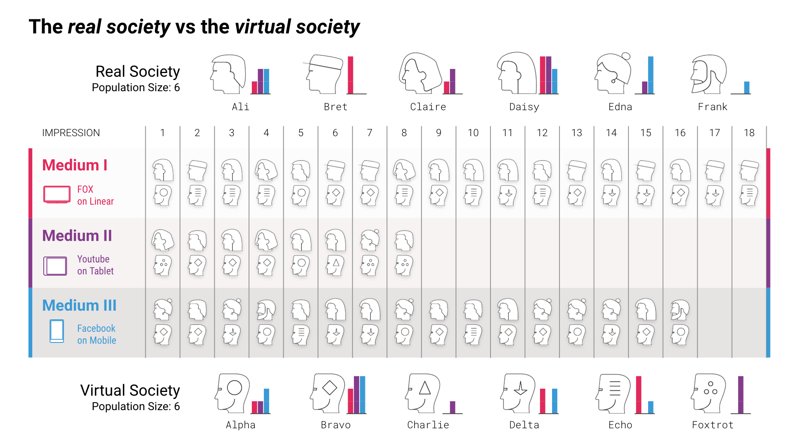

# Audience modeling toolbox
Welcome to the reporsitory for the `audiency_modeling_toolbox` package. This package is currently used to model the audience behavior and generate *virtual societies* as a part of the OpenMeasurement Project.

You can [try out for yourself on a google colab notebook](https://colab.research.google.com/github/OpenMeasurement/virtual_society_modeling_framework/blob/main/notebooks/virtual_society_basic_illustration.ipynb).

# The OpenMeasurement Project

We believe every human on the planet should have free access to the world’s information and content. This is powered by a three way value exchange between a media owner publishing free content, a consumer consuming it and an advertiser paying for the chance to connect with the media owner’s audience. The underpinning of this value exchange relies on having an independent auditing, measurement and optimization layer to power the transaction between the advertiser and media owner. Today the industry standard tools for advertising and media measurement and optimization are usually designed where increased personalization, higher advertising return on investment and increased media owner revenues often comes with negative trade off for consumer privacy or security risks of leaking private data. We envision a world where this doesn't have to be the case - a world where consumer privacy, security, and governance are incorporated into the fabric of the codebase while enabling the necessary business use-cases to effectively keep the world’s information and content free for everyone.

Advertisers need to measure the performance of their ad campaigns in order to understand their efficiency and optimize future buys.  However, as the advertising landscape has fragmented across multiple platforms and devices, the ability to measure true “deduplicated” cross-media reach and frequency has become more difficult.  At the same time, living in the information age almost all viewership activities can be logged.  It is therefore reasonable to begin to imagine the possibility of a universal, all-inclusive, reach and frequency deduplication report across all media.  The major obstacles to achieving this goal are issues with sharing viewership data.

Currently the ad viewership data is primarily owned by the publishers. This means that the necessary first step to achieve true cross-media measurement is the ability to aggregate ad viewership data across multiple publishers. However, there are many technical, legal and other obstacles to achieve this. First, important and potentially sensitive information about individual users can be revealed in the joined data. In addition, publishers usually do not trust sharing their valuable viewership data with their competitors.  As a result, we need a privacy-preserving framework for ad data collection across multiple parties.

The OpenMeasurement Project is inviting engineers, data scientists and researchers to come together to deliver the open source dream without dilution - open and free to anyone who wants to join and an environment where the best ideas win versus poltical gains or optimizing for one companies benefits. We believe that any future privacy by design cross screen measurement solution must be fully open source, with an open-core ecosystem around it, to ensure trust among advertisers, content creators, and consumers as well as facilitating collaboration between many parties.  

In [our first research project](https://github.com/OpenMeasurement/virtual_ID_research) in open measurement we built upon the basic Virtual Identifier (VID) modeling, see also the Google tech report.  We extend the virtual people modeling to virtual society modeling improving the privacy and accuracy of reach frequency measurements on our virtual societies relative to the VID framework.  This latest solution simulates the activity of real society through virtual societies, thus ensuring individual user privacy.  We aspire to provide the following
 * A completely open framework, to test, verify, and utilize by all the parties.
 * A flexible methodology, to take into account the desired measurement quantities, advertising patterns, targeted audience, as well as the fundamental difference between different types of impressions.

## How is the new approach different?
Let us explicitly point out the main fundamental differences between our suggestion, the *virtual society modeling* and the previous suggested approaches.
1) We advocate for a choice of campaign (or advertiser) specific VID modeling. This allows to specifically target the need of each advertiser separately. Of course this is more computationally involved but is a necessary ingredient to any meaningful measurement based on VID modeling.

2) We emphasize on the choice of multidimensional reach-frequency distribution as a source of training for the VID model instead of the suggested *reach* surface. Note that the terminology might be confusing, the reach surface in previous studies refers to the *1+ reach* (the total number of people reach once or more), however we believe that the reach-frequency distribution (or the number of people reached an exact number of times in each media) is a better choice.

3) We suggest a more structured mathematical description of the modeling in order to respect the frequency distribution, specifically the *long tail* of the TV viewership. More specifically, the choice of delta functions does not follow the required tail of the TV viewership distribution.

4) We emphasize on the importance of reporting the reach-frequency distribution in a media-specific (multidimensional) way in order to provide the ability to value impressions on different media in a different fashion. For example, it is important to not treat an impression on full screen TV with an online impression on the same footing.

Comparison of the virtual society modeling  from the basic VID + sketch methodology

| What | Virtual society | basic VID + sketch |
| :-: | :-:| :-: |
| Aggregate reach in regular campaigns | Yes | Yes |
| Aggregate reach for outlier campaigns | Yes | Yes, but large error |
| Campaign specific granular info | Yes | No |
| Faithful to the frequency distribution | Yes | No |
| Possible to treat impressions differently | Yes | No|
| Controllable user privacy level | Yes, with simple tweaks | Yes |
| Simplicity on the publisher side | Yes | Yes, but mutliple levels|

## Example of error generated in the VID assignement process
For comparison we also include the errors generated by the VID modeling for a simulated campaign of 10000 individuals. We have chosen the GRP of `400%` and `800%` across `Medium I` and `medium II` respectively. Thefore the average frequency is `4.0` and `8.0` across each medium. You can follow the same calculations yourself in the notebook.

| Parameter | Measurement report | Virtual Society | Virtual Society error | basic VID | basic VID error |
| :-: | :-: | :-: | :-: | :-: | :-: |
| 1+ reach | 9675 | 9712 | 0.3 % | 9713 | 0.3 % |
| Exclusive reach on I | 1016 | 974  | 4.1 % | 649 | 36.1 % |
| Exclusive reach on II | 2028  | 1993 | 1.7 % |1831 | 9.7 % | 
| Overlap between I, II | 6631 |6805 | 2.6 % |7231 | 9.05 %  |

The figures below show the detail errors for the bins in the frequency. First for the error in full two dimensional reach-frequency surface

as well as the total (all media) frequency distribution errors

The important point to note here is a good error rate only on the deduplicated reach is not enough. As you see, both methodologies get the total reach almost exactly correct.

## A review of privacy in ad measurement
There are multiple methods to approach privacy-preserving ad measurement. A well explored option is to simply add an appropriate amount of noise to the data aggregation. This noise “smears” the outcome of the report  and thus prevents the revealing of any traceable sensitive private information about an individual viewer. It is possible to formulate the exact amount of noise required by means of rigorous mathematical definition -- a key theme in the rising new field of differential privacy, see [Dwork2006](https://www.microsoft.com/en-us/research/publication/differential-privacy/) for a review. However, this addition of noise alway comes with the price of losing accuracy. For example early experiments have shown that if publishers add noise separately to their local data and then aggregate, the final outcome may not possess the required level of accuracy for the frequency estimation [Kreuter2020](https://research.google/pubs/pub49177/).

Another approach is to use virtual people. Virtual people are fictitious individuals represented by IDs (numbers) that are possibly equipped with demographics and interests as well as the probability of exposure (activity) in each media. These virtual people match the total number as well as the statistical characteristics of the census, and their activities mimic the reach and frequency of the real advertising campaigns.  Mapping impressions to VIDs creates a possible layer of privacy for ad campaigns and provides a common identity space for different publishers to share.  However, a problem with a general model of virtual people is that they would either be almost exactly the actual people (leading exactly correct deduplicated reach and frequency if all people are observed) or too generic leading to large measurement errors, resulting in the inability to apply the model to different campaigns. As we will discuss, the solution to this problem is to generate a separate virtual society of people for each ad campaign.

It is important to note that, despite the probabilistic nature of VID assignment for ad viewership, this process by itself does not protect individual users privacy and VID impressions logs should not be distributed across publishers without further processing.  If we only desire the aggregated total reach, we can use a set of noisy cardinality estimators on top of the VID ad logs.  This process, known as differential privacy, protects the individual viewership pattern.  Multiple parties can combine their differentially private results to obtain the overall deduplicated reach. This approach can be extended to frequency estimation as well but does not generally result in an acceptably low amount of error (in our opinion). These methods are under active development in the [WFA repository](https://github.com/world-federation-of-advertisers).

We believe that this approach of using virtual IDs as a common ID space and then using WFA sketches on top of the VID modeling to provide the desired level of privacy has the following drawbacks:
- A generic VID modeling for all possible scenarios cannot have the desired accuracy
- A generic VID modeling does not respect the specific frequency distribution properties of different media
- The advertised accuracy of the WFA sketches is poor
- When WFA sketches are applied on the VID modeling, the errors in the frequency distribution and even aggregate information, such as total reach, are quite large

The OpenMeasurement plan is to combine the two levels of methodology into a single approach that is specific for each application. These models, called *virtual societies*, are designed to respect the cross-media frequency distribution, and provide the desired level of privacy whenever necessary. Moreover, the error for the outcome of a virtual society modeling is much more controllable compared to WFA methodology of sketches on top of a VID.

## Virtual Societies
We believe that a flexible methodology is only possible if a specific virtual society is tweaked and designed separately for each campaign. Virtual society is simply a table of virtual individuals equipped with certain demographics and/or interests that have a tendency to receive advertisement through different media.  We call this tendency of exposure “activity.” This could be the tendency to generate specific cookie types in the case of digital advertising or the tendency to watch a specific network in the case of TV.

The virtual society provides the first level of user privacy as the virtual users do not correspond to actual users, but they only follow the same distribution as our actual society. Moreover, additional levels of privacy could also be combined with the virtual society approach.

The VID assignement starting from the Impressions on each publisher side (here Medium I and Medium II) is shown in the flowchart below.

## A recipe to generate a *virtual society*

_**You can skip this part and get your hands dirty instead:** [try it out for yourself on a google colab notebook](https://colab.research.google.com/github/OpenMeasurement/virtual_society_modeling_framework/blob/main/notebooks/virtual_society_basic_illustration.ipynb)._

Below we illustrate the steps to create virtual societies and assign cross screen impression logs to them. 

 - **Step I)** The starting point is cross screen empirical measurement data. This can come from a dedicated cross screen measurement panel, or from a pseudo-panel made using identity resolution techniques, where for each publisher at least a fraction of the data has had identities resolved. We aggregate the data along frequency bins for each publisher resulting in a [mutlidimensional reach-frequency distribution] (reach surface).

- **Step II)** The ADF modeling framework then uses the empirical data to model an activity distribution function (ADF). An ADF is a function that captures the rate at which different members of the population or society are exposed to advertisements in each medium. We call the rate of exposure *activity* and hence the function is called the activity distribution function. This is the most challenging and technical part of the process. The mathematical details of the ADF are laid out on our “Mathematical Framework of Audience Modeling” page in the documentation. The important point to understand is that the ADF is a representation of the percentage of the population with each exposure rate or activity. 

The process of training the ADF depends on accuracy and the size of empirical data available. We note that it is more accurate to have measurement at different snapshots of time instead of a single measurement at the end of the campaign. This is because it is easier for the modeling to capture the behavior of society by observing how the frequency distribution grows as a function of time (or more accurately as a function of more impressions). Therefore we advocate for using the time evolution of the reach surface instead of the final result.

- **Step III)** ADF is then utilized by virtual society generators to output the virtual society table. A virtual society is a set of virtual IDs with the corresponding activity (rate of exposure) for each media. Below is an example of a virtual society 

| Virtual person ID | Activity on Medium 1 | Activity on Medium 2 | ... | Demographics |
| -: | :-: | :-: | :-: | :-: |
| 1 | 0.1 | 1.5 | ... | 18-24 old, Male, White |
| 2 | 1.3 | 0.2 | ... | 65-74 old, Female, Hispanic |
| ... | ... | ... | ... | ...|

Each publisher/media has their own activity column. This could in principle be even private and not accessible by other parties.

- **Step IV)** The publishers then use the activity column of the virtual society to assign their impression logs to Virtual persons IDs using deterministic hash functions. Depending on the nature of the virtual society and the modeling, this process provides a first step toward individual user privacy and ensures that all the publishers are mapping their impressions to the same exact user space. This is a probabilistic identity resolution scheme that closely follows the content exposure behavior of our real society.

- **Step V)** The advertiser receives all the impression logs and deduplicates the virtual IDs to find the multidimensional reach and frequency surface and consequently calculate exclusive reach, total reach, target frequency reach, and other relevant measures for optimization and further advertising planning.

## Definitions and examples
### The multidimensional reach surface
At the core of cross-screen measurement reporting is the concept of the multidimensional reach surface. A multidimensional reach surface is a distribution of the reach of an advertising campaign as a function of exact frequency of exposure on each dimension (or medium).   The simplest example, is a single dimensional reach and frequency distribution as in the figure below

We can also plot a two dimensional version of the reach surface for two types of media exposure. We call them MEDIUM I and MEDIUM II. The distribution shows the (n, m)-reach for the frequencies n for MEDIUM I and m for MEDIUM II for the given report.

This virtual society framework models the behavior of the whole society. We can use a virtual society mapping that was tailored for the above example campaign and generate a two dimensional reach surface that looks like the figure below

There are no restrictions on the dimension of the reach surfaces (other than the computational complexity of course). So we are able to generate reach surfaces across three, four, or more media types.  However, visualizing higher dimensional reach surfaces is difficult on a 2D screen, and as a result we don’t include examples of higher dimensional reach surfaces here.

### The activity distribution function (ADF)
Below we illustrate the concept of ADF by comparing the ADF of a normal society with the ADF of a virtual society generated using our framework. The activity distribution of a normal society looks like the plot below. Each dot corresponds to a single individual with a corresponding activity on two media which here we label MEDIUM I and MEDIUM II. As you can see, there are more people with lower activity. We note that in reality content consumers usually follow a power law distribution for activity.   For example, most television viewers don’t watch very much television, but a small percentage of viewers watch a large amount of TV so that they account for a significant portion of all television watched.

Now compare this to the ADF generated by the framework for a virtual society. The two societies are very different while they both follow a similar distribution. It is clear from looking at the plot of this ADF that the domain was chosen in a structured rather than a noisy way that would produce a plot similar to figure below.  However, we emphasize that the aggregates do behave almost identically to the aggregates of the original society that they model.

# Roadmap
The future of privacy preserving advertisement and measurement is still unclear and many of the aspects of the final methodology are still under research and experimental development. Even ignoring the ethical merits of exploring the potentials of a private advertising and measurement platform, it is important for the industry to remain vigilant to catch up with the advancements as they unfold, invest in the potential technologies, and test them in their early stages in order to be prepared for when such technologies are no longer merely research ideas but a necessity of remaining a strong competitor in the market. 

Privacy-preserving measurement is a fast-evolving field. We wish to implement multiple virtual society modeling methods that fit different needs and situations. In particular we’d like to follow the roadmap below:
- Introduce multiple modeling methods for the activity distributions
- Introduce appropriate noise functions for the activity distributions 
- Introduce different mechanisms to generate virtual society modeling

# Code structure and documentation
Please look at the documentation for the detailed structure of the code.
